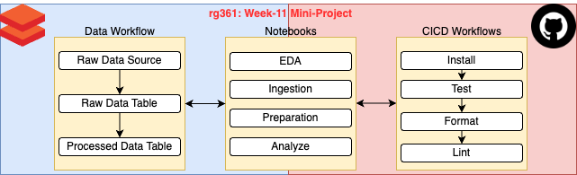
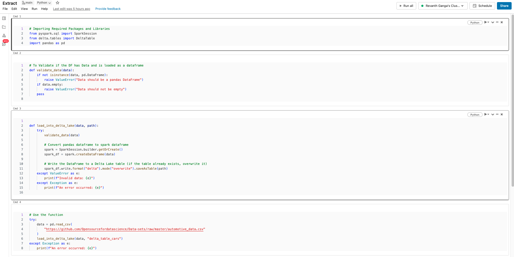
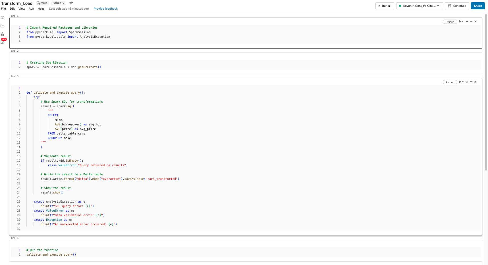
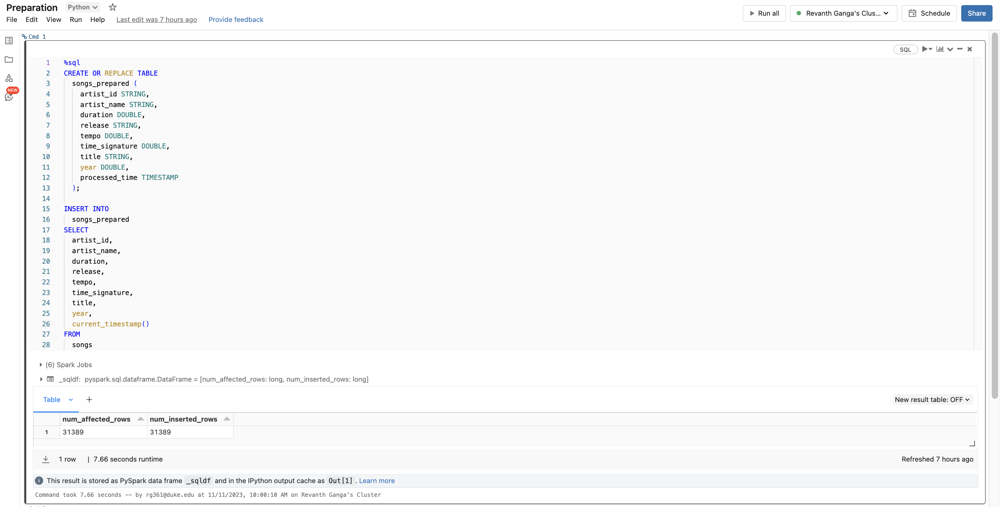
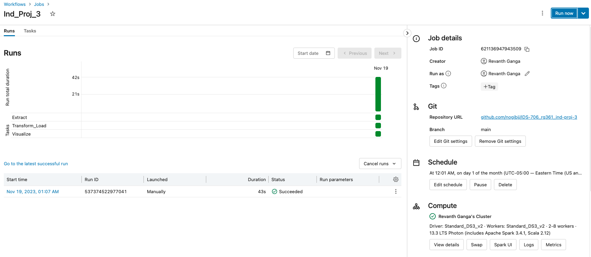
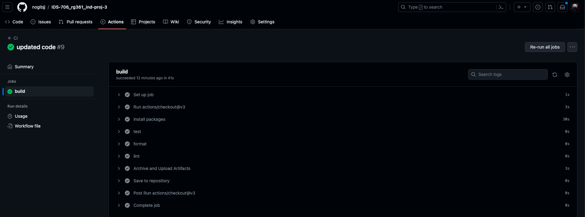

# Databricks ETL Pipeline

This repositroy contains files to perform ETL operations in ``Databricks`` using ``PySpark``, ``Python``, ``Delta Tables``  and ``SQL``

The base repo has been created from [Week-11 Mini-Project](https://github.com/nogibjj/IDS-706_rg361_week-11) and modified as per requirements.

Created on on 15-Nov-2023

## Overview

This project performs a sample ETL operations in Databricks.
The sample data is loaded from [Github]("https://github.com/Opensourcefordatascience/Data-sets/raw/master/automotive_data.csv") and the notebooks used for processing are saved in this Github Repository in the ``Notebooks`` folder.

A Databricks ``workflow`` is setup to run the notbooks in sequence to simulate the End-to-End workflow.

``Github`` actions automatically performs the ``CICD`` workflows whenever there is a change in the repository.

## Instructions

The Primary data and operations happen in the Databricks platform.

We use the [Automotive]("https://github.com/Opensourcefordatascience/Data-sets/raw/master/automotive_data.csv") dataset from Github for this process.

3 Notebooks have been created to perform the following tasks or steps in the pipeline:

1. ``Extract``: To load the raw data from the source and save it as a ``Delta Table`` in the workspace

2. ``Transform_Load``: This notebook loads the data from the raw-data delta table and processes it and saves the result in a processed delta table

3. ``Visualize``: This notebook reads the data from the processed table and generates a visualization of the data and also saves the visualization as a file in the repository

## Workflows
There are 2 workflows which happen in this project, the ETL worflow which happens in Databricks and the CICD worflow which happens in Github.

### ETL Worflow
A simple workflow ``Ind_Proj_3`` has been setup in Databricks which performs the following 3 actions using the corresponding notebooks as mentioned above:
1. Extraction
2. Transformation and Loading
3. Visualization

Sucessful execution of Databricsk Workflow:

**Note**: The workflow is set to be triggered automatically once a month to save costs.

### CICD Workflow
github actions are used to automate the following processes whenever a change is made to the files in the repository:
   - ``install`` : installs the packages and libraries mentioned in the requirements.txt
   - ``test`` : uses ``pytest`` to test the python script
      
      **Note:** Currently there is no test setup since the files and workflow runs in Databricks.
     
   - ``format`` : uses ``black`` to format the python files
   - ``lint`` : uses ``ruff`` to lint the python files

**Note** -if all the processes run successfully the following output will be visible in github actions:
   

   
## Contents
The Github Repository Contains the following items:

### 1. README.md
   contains the information about the repository and instructions for using it
   
### 2. requirements.txt
   contains the list of packages and libraries which are required for running the project. These are intalled and used in the virtual environment and Github actions.
   
### 3. .github/workflows
  Contains the ``cicd.yml`` file which has the steps and instructions for the Github CICD workflow (using Github Actions)
 
### 4. Makefile
   contains the instructions and sequences for the processes used in github actions and .devcontainer for creating the virtual environment
   
### 5. .devcontainer
   contains the ``dockerfile`` and ``devcontainer.json`` files which are used to build and define the setting of the virtual environment (codespaces - python) for running the codes.

### 6. Notebooks
   The 3 notebooks which are mentioned earlier are stored in the ``Notebooks`` folder in this Github repository so as to have version control and CICD

### 7. plot.png
   The output plot which is generated by the visualization step in the notebook

### 8. resources 
   contains additonal files which are used in the README

  
